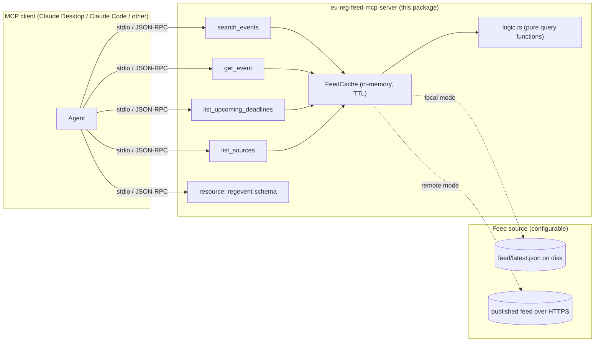

# eu-reg-feed MCP server

An [MCP](https://modelcontextprotocol.io) (Model Context Protocol) server that
puts the [eu-reg-feed](../README.md) RegEvent feed in front of any MCP client,
including Claude Desktop, Claude Code, or any other agent that speaks the
protocol, as four tools and one resource. It is a thin, typed layer over the
feed: it does no scraping and no writing, only search and lookup over
whatever feed document it is pointed at.

Built with the official [`@modelcontextprotocol/sdk`](https://www.npmjs.com/package/@modelcontextprotocol/sdk)
(TypeScript), stdio transport, and [zod](https://zod.dev) for input validation.

## Quick start

**1. Install and build**, from inside `mcp-server/`:

```bash
cd mcp-server
npm install
npm run build
```

**2. Point it at a feed.** By default it reads `../feed/latest.json`, the
committed feed in a checkout of the parent repo, so if you cloned
`eu-reg-feed` and are running the server from inside it, there is nothing else
to configure. To use the published feed instead, with no local checkout:

```bash
export EU_REG_FEED_SOURCE=remote
```

See [Configuration](#configuration) for every variable.

**3. Add it to your MCP client.** For Claude Desktop
(`claude_desktop_config.json`) or Claude Code (`.mcp.json`):

```json
{
  "mcpServers": {
    "eu-reg-feed": {
      "command": "node",
      "args": ["/absolute/path/to/eu-reg-feed/mcp-server/dist/index.js"],
      "env": {
        "EU_REG_FEED_SOURCE": "remote"
      }
    }
  }
}
```

Drop the `env` block to read the local checkout instead. Restart the client
and the four tools below become available.

## Tools

| Tool | Purpose |
|---|---|
| `search_events` | Filter events by regulator, type, keyword, and/or publication date range |
| `get_event` | Fetch one event by its exact `id` |
| `list_upcoming_deadlines` | Events with a `response_deadline` in the next N days, soonest first |
| `list_sources` | Regulators the project targets (working and planned), plus live feed stats |

### `search_events`

```json
{ "regulator": "eba", "type": "consultation", "dateFrom": "2026-09-01" }
```

```json
{
  "count": 1,
  "events": [
    {
      "id": "urn:regevent:v2:eba:node-20011",
      "type": "consultation",
      "regulator": "eba",
      "title": "Consultation on draft RTS on credit risk adjustments",
      "published": "2026-09-10T09:00:00.000Z",
      "response_deadline": "2026-10-15",
      "status": "open"
    }
  ]
}
```

### `get_event`

```json
{ "id": "urn:regevent:v2:cssf:p-128522" }
```

Returns `{ "event": { ... } }`, or `isError: true` with a text explanation if
the id is not in the current feed.

### `list_upcoming_deadlines`

```json
{ "days": 30 }
```

```json
{
  "days": 30,
  "deadlines": [
    {
      "days_remaining": 15,
      "event": { "id": "urn:regevent:v2:esma:...", "response_deadline": "2026-10-05", "...": "..." }
    }
  ]
}
```

### `list_sources`

No arguments.

```json
{
  "regulators": [
    { "id": "esma", "name": "European Securities and Markets Authority", "status": "working" },
    { "id": "bafin", "name": "Bundesanstalt für Finanzdienstleistungsaufsicht", "status": "planned" }
  ],
  "feed": { "generated_at": "2026-09-09T08:41:08.297Z", "total_events": 20, "total_errors": 0 }
}
```

## Resource

`eu-reg-feed://schema/regevent` returns the full
[RegEvent JSON Schema](../schema/regevent.schema.json) (draft 2020-12), the
same schema every event in the feed conforms to. A client can read it once and
use it to validate or explain the shape of anything the tools return.

## Architecture



Each tool call asks the `FeedCache` for the current document; the cache reads
from disk or fetches over HTTPS on a miss, validates the result with zod, and
hands a typed `FeedDocument` to the pure functions in `logic.ts`, which do the
actual filtering and are unit-tested with no server or transport involved at
all. The `server.ts` / `tools/*.ts` layer only translates between that typed
data and the MCP wire format (zod input schemas, `content` +
`structuredContent` results).

## Design notes

**Why these four tools, and not more.** They cover the two things a consumer
of a regulatory feed actually asks: "what happened / is happening" (search,
get) and "what do I owe a response to, and by when" (deadlines). `list_sources`
exists so an agent can answer "do you cover BaFin" without guessing from the
README. A `list_event_types` or `list_regulators` tool was considered and
dropped: both are small, static enumerations better exposed as part of
`search_events`'s own input schema (a client can already see the valid enum
values there) than as a fifth tool.

**Error handling.** A feed load has three distinct outcomes: reachable and
valid (`ok`); reachable but malformed (`invalid`, meaning bad JSON or an event
that fails the RegEvent schema); and unreachable (`unavailable`, meaning a
missing file, network error, timeout, or non-2xx response). Every tool
surfaces the distinction as a readable `isError: true` message rather than an
uncaught exception or a generic failure. `get_event` on an unknown id is
treated the same way: a normal, expected outcome reported as a tool error, not
a protocol error, so a client can show the message to a user or an agent can
retry with `search_events` instead.

**Caching.** One process serves one client for its whole lifetime (stdio), so
re-reading the same feed on every tool call buys nothing and, against the
remote source, is needlessly impolite to GitHub's raw-content host. `FeedCache`
holds the last successfully loaded document in memory and reuses it until
`EU_REG_FEED_CACHE_TTL_MS` (default 5 minutes) elapses; a failed load is never
cached, so a transient network error does not lock the server into serving
nothing until the TTL clears.

**Limits.** `search_events` caps `limit` at 100 and clamps a smaller or larger
request to `[1, 100]` server-side rather than trusting the caller, so a client
cannot accidentally ask for (and force a serialization of) the whole feed in
one call. The feed itself is small today, on the order of tens of events; this
cap is a discipline decision, not a response to a real scale problem yet.

**What this server does not do.** It does not fetch from regulators (that is
the parent project's aggregators), does not write to the feed, and does not
retry a failed remote fetch: a single request with a 10-second timeout
(`EU_REG_FEED_FETCH_TIMEOUT_MS`), reported as `unavailable` on failure. Retry
and backoff were left out deliberately: this is a read path for an agent, and
a swallowed retry that turns a real outage into extra latency is worse than a
fast, honest error the caller can act on.

## Configuration

All environment variables, all optional:

| Variable | Default | Meaning |
|---|---|---|
| `EU_REG_FEED_SOURCE` | `local` | `local` reads a file; `remote` fetches over HTTPS |
| `EU_REG_FEED_PATH` | `../feed/latest.json` (relative to this package) | Local feed path |
| `EU_REG_FEED_URL` | the `main` branch's published `feed/latest.json` | Remote feed URL |
| `EU_REG_FEED_SCHEMA_PATH` | `../schema/regevent.schema.json` | Local RegEvent schema path, for the resource |
| `EU_REG_FEED_SCHEMA_URL` | the `main` branch's published schema | Remote RegEvent schema URL, for the resource |
| `EU_REG_FEED_CACHE_TTL_MS` | `300000` (5 min) | How long a loaded feed is reused |
| `EU_REG_FEED_FETCH_TIMEOUT_MS` | `10000` (10 s) | Remote fetch timeout |

## Development

```bash
npm install
npm run typecheck   # tsc --noEmit
npm test             # vitest, against tests/fixtures/feed.json
npm run build        # tsc, emits to dist/
npm start             # runs the built server over stdio
```

The test suite has three layers. `tests/logic.test.ts` unit-tests the pure
query functions against a small fixture feed. `tests/feedSource.test.ts`
covers the local/remote loader and cache, including malformed JSON, a missing
file, a non-2xx response, and a network error, all without touching a real
network. `tests/server.test.ts` runs the actual MCP server against a real
`Client` over the SDK's `InMemoryTransport`, so the JSON-RPC round trip and
zod input validation are exercised end to end, not just the logic underneath
them.

Not published to npm and not part of the parent project's own CI workflow
(`.github/workflows/ci.yml`) yet: wiring that in, and deciding whether this
package moves to a scoped npm name if the parent project ever publishes, is
left to the maintainer.

## License

Apache-2.0, same as the parent project. See [`../LICENSE`](../LICENSE).
